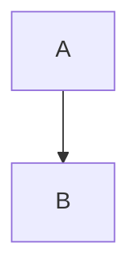
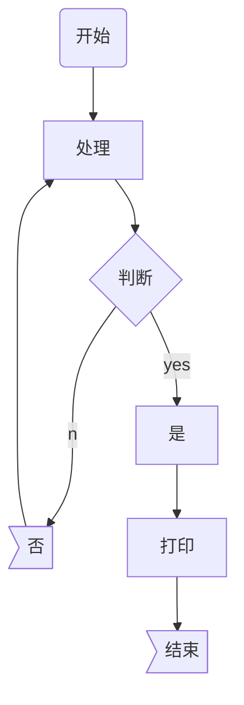

# Makdown的使用
Makdown作为在GitHub上创建项目时，写README.md文档的常用语言，在此总结一些Makdown的常用标签与基本用法。
- 希望对你有帮助～
## Makdown常用标签
|标签|介绍|描述|示例|
|:---:|:---:|:---:|:---:|
|```[TOC]```|目录|根据# 标题自动生成文章目录<br>使用方法：```[TOC]```|[TOC]|
|```#```|一级标题|段落前使用 # 空格，常用于标头名。<br>使用方法：```# 一级标题```|# 一级标题|
|```##```|二级标题|段落前使用 ## 空格，常用于段落名。<br>使用方法：```## 二级标题```|## 二级标题|
|```###```|三级标题|段落前使用 ### 空格，常用于子段落名。<br>使用方法：```### 三级标题```|### 三级标题|
|```#...*6```|六级标题|标题越大展示效果越小，超过三级标题的不常用。<br>使用方法：```###### 六级标题```|###### 六级标题|
|```*倾斜*```|倾斜|倾斜文本内容，起到辅助提示作用。<br>使用方法：```*倾斜*```|*加粗*|
|```**加粗**```|加粗|加粗文本内容，起到提示作用。<br>使用方法：```**加粗**```|**加粗**|
|```***加粗倾斜***```|加粗倾斜|加粗倾斜文本内容，起到强调提示作用。<br>使用方法：```***加粗倾斜***```|***加粗倾斜***|
|`` ```代码``` ``|代码|在文本内容中插入代码，起到内容区分作用。<br>使用方法：`` ```print Hello World``` ``|```print Hello World```|
|```1. 有序列表```|有序列表|段落前使用 1. 空格，换行自动创建有序列表。<br>使用方法：```1. 有序列表```|1. 有序列表|
|```- 无序列表```|无序列表|段落前使用 - 空格，换行自动创建无序列表。<br>使用方法：```- 无序列表```|- 无序列表|
|```+ 无序列表```|无序列表|段落前使用 + 空格，换行自动创建无序列表。<br>使用方法：```+ 无序列表```|+ 无序列表|
|```>```|引用|段落前使用 > 空格,创建引用或者多层嵌套。<br>使用方法：```> Makdown的使用```|> Makdown的使用|
|```~~杠掉~~```|杠掉|内容前后使用，**按英文** ~~ 。<br>使用方法：```~~杠掉~~```|~~杠掉~~|
|```\```|转译|转译特殊符号,使其不具备执行代码性能，**按英文** \ 。<br>使用方法：```\<scrpit\>```|\<script\>|
|```\|```|表格|创建表格，**按英文** \|分割表格内容。<br>使用方法：```\|序号\|列名\|```|\|序号\|列名\||
|```:-```|左对齐|左对齐表格内容，**按英文**:- 展示表格内容。<br>使用方法：```\|:---\|```|\|:---\||
|```-:```|右对齐|右对齐表格内容，**按英文**-: 展示表格内容。<br>使用方法：```\|---:\|```|\|---:\||
|```:-:```|居中对齐|居中齐表格内容，**按英文**:---: 展示表格内容。<br>使用方法：```\|:---:\|```|\|:---:\||
|```-----```|水平分割|在列表，或内容后创建水平分割线。<br>使用方法：```-----```|-----|
|``````|图片|引用本地或外链URL地址的图片。<br>使用方法：``````||
|```[连接](URL地址)```|超链接|在内容中引用超链接。<br>使用方法：```[连接](URL地址)```|[Makdown的使用](https://github.com/13330095222/Makdown/edit/main/README.md)|
|`` ```mermaid``` ``|流程图|创建流程图<br>使用方法：`` ```mermaid``` ``|```mermaid```|
|```$$公式$$```|公示|创建公式。<br>使用方法：```$$\sum_{i = 0}{n_i^2}$$```|$$\sum_{i = 0}{n_i^2}$$|

## Makdown流程图
从上到下


<pre>

</pre>

从左到右

<pre>

</pre>

不同形状

<pre>

</pre>

分支判断

<pre>
```mermaid
graph TD
	开始(开始) --> 处理[处理]
	处理[处理] --> 判断{判断}
  判断{判断} --no--> 否((否))
	  否>否] --> 处理[处理]
  判断{判断} --yes--> 是[是]
  是[是] --> 打印[打印]
  打印[打印] --> 结束>结束]
 ```
</pre> 

